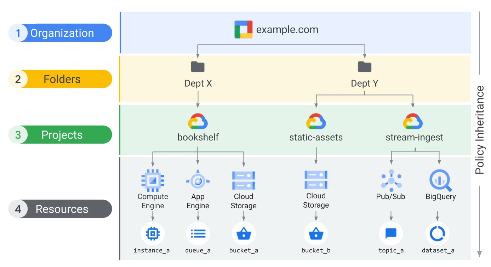

# GCP Playground
## Resource hierarchy



More details here: https://cloud.google.com/resource-manager/docs/cloud-platform-resource-hierarchy

## Create a Project and link it to a Billing Account

```bash
gcloud projects create first-project-hugh-mungus \
  --name="First Project - Hugh Mungus" \
  --labels=purpose=demo

gcloud projects list

gcloud config set project first-project-hugh-mungus

gcloud beta billing accounts list

gcloud beta billing projects link first-project-hugh-mungus \
  --billing-account=0X0X0X-0X0X0X-0X0X0X
```

## Set Region and Zone

```bash
gcloud compute regions list
gcloud compute zones list

gcloud config set compute/region europe-west1
gcloud config set compute/zone europe-west1-b
```

## Install our first VM

```bash
gcloud services list --available | grep -i compute
gcloud services enable compute.googleapis.com

gcloud compute machine-types list \
  --filter "name=f1-micro AND zone=europe-west1-b"

gcloud compute images list

gcloud compute instances create first-vm \
  --machine-type f1-micro \
  --image-project debian-cloud \
  --image-family debian-10 \
  --labels purpose=demo \
  --metadata startup-script="curl -sL https://raw.githubusercontent.com/haramia/gcpplayground/master/debian10-setup/tool-setup.sh | sudo bash"

gcloud compute instances list
```

## Creating a Repository for our nice shiny containers
```bash
gcloud services list --available | grep -B 1 -A 1 "TITLE: Artifact"
  
gcloud services enable artifactregistry.googleapis.com

gcloud artifacts locations list

gcloud config set artifacts/location europe-west1

gcloud artifacts repositories create demo-repo \
  --repository-format docker \
  --description "Awesome repo for awesome people" \
  --labels purpose=demo

gcloud artifacts repositories list
```

## Create a Kubernetes Cluster

```bash
gcloud services list --available | grep -B 1 -A 1 "TITLE: Kubernetes"

gcloud services enable container.googleapis.com

# FANCY AUTOPILOT

gcloud container clusters create-auto demo-cluster-fancy \
  --region europe-west1

# CLASSIC

todo
```

## Build and push our first container

```bash
gcloud auth configure-docker europe-west1-docker.pkg.dev

git clone https://github.com/haramia/gcpplayground

docker build -t pizza:latest ./gcpplayground/nginx/pizza/

docker tag pizza:latest europe-west1-docker.pkg.dev/first-project-hugh-mungus/demo-repo/pizza:latest

docker push europe-west1-docker.pkg.dev/first-project-hugh-mungus/demo-repo/pizza:latest
```

## Deploy the container

```bash
todo
```
